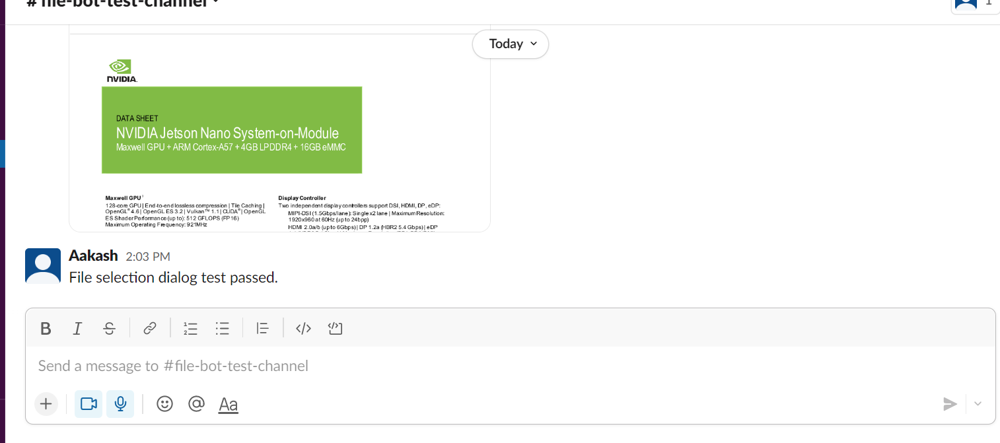

**A slack bot to upload files made using Golang**

Setting up everything and testing the bot:
1. On slack api, go to OAuth and Permissions and add various scopes
like channel read, chat write, file read and write, im read and write, remote files
read write share etc.
2. Create a new channel or choose from existing channels and get the channel id.
3. Also get the Bot User auth token.
4. Install the package "github.com/slack-go/slack" using "go get github.com/slack-go/slack" command.
5. Verify if packages are fine using "go mod tidy".
6. Run "go mod init "github.com/your-user-name/slack-file-bot".
7. Run the main.go file by altering the file path. ("go run main.go")

 
Below is a test result of "Test.txt" uploaded by the file bot. 

 

Further Plans: 
1. Add an interface.

